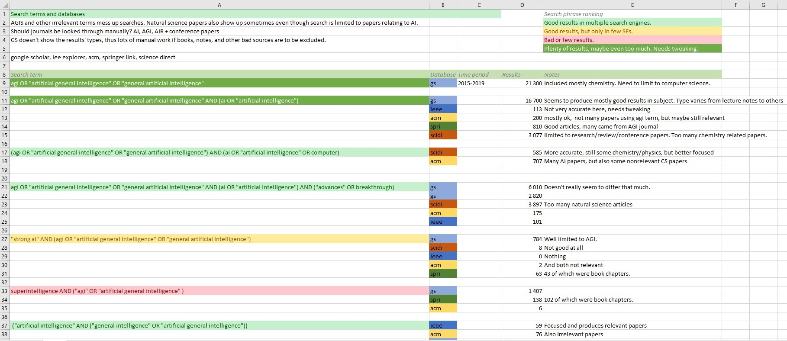

# Research question proposition
*Author Samu Kumpulainen*

Here's some background info and questions I've been thinking about. I've marked few questions with QUESTION-word, that I would need some comment on, if possible.

> QUESTION: Are these research questions good? Or should they be narrowed more? The task is difficult as the goal is to achieve general overview of the field.

## Possible research Questions
1. **How much, and what type of research is done in the field of AGI?**
      - What is the current state of AGI research? -> How much research is done in recent years? What is the overall trend (interest growth/decline)? 
      - What type of research it is (research methods, types)
2.  **Where is the AGI research focused on?**
    - This includes
       - topics
       - techniques
       - technology
    - What are the current techniques (and topics) used and researched?
    - How the research is focused on the field? 
    - *(How it has changed over time? Can this be observed on such short time)*
3. **Has there been any major breakthroughs?**
    - What have been the most successful attempts?
4. **Where and when were the studies published?**
    - Time
    - Journal

> QUESTION: What about the keywords? Are there some terms that I should also consider here?

## Keywords picked from the research questions

- artificial intelligence, AI
- general artificial intelligence & artificial general intelligence, AGI
- general intelligence
- success, advances, development, breakthrough?

- The search needs to be limited to software engineering/computer science because often search attempts with abbreviation AGI would result in natural science related papers about AgI-compounds.
  - This could be accomplished by combining abbreviations with complete terms, such as:
    - software engineering, computer (science), artificial intelligence

### Possible relating keywords
- superintelligence
- strong ai
- turing test

> QUESTION: Should I proceed with the more general, database search based option, or just focus on the relevant journal and conference archives? Both options are presented below.

## Database search plan
- Search is performed using phrases derived from the aforementioned keywords.
- Possible databases and search engines: IEEE Explore, ACM Digital Library, Science Direct, Springer link and Google Scholar. 
  - Scholar searches other databases, and produces very different kinds of results. However it is very effective option.

### Possible search phrases

- I've tested some search phrases to check how they would produce results:
  
- TODO: Final phrases need to be decided.

## Journal based option

- Search would be focused on few select journals.
- This would change the tactic a bit, e.g. JAGI focuses solely on AGI, so naturally most of it's articles are related to it, being almost certainly included.

Publication Forum, Julkaisufoorumi, ranks the journals, with 1-3, 3 being the top quality journal.
(https://www.tsv.fi/julkaisufoorumi/haku.php?lang=en)

- **Artificial Intelligence (3)** https://www.journals.elsevier.com/artificial-intelligence
    - Best AI journal, whole field of AI. Useful, but not specific.
- **Journal of Artificial Intelligence Research (3)** https://www.jair.org/index.php/
    - All areas of AI. Open Access. Not Specific.
- **Journal of Artificial General Intelligence (1)** https://content.sciendo.com/configurable/contentpage/journals$002fjagi$002fjagi-overview.xml
    - Owned by AGIS
    - Only level 1, which is because of the fact that it’s really specific.

There is pretty much only 2 of level 3 journals on any AI field.

> QUESTION: Furthermore, should conference papers such as this be included?
 
  - **International conference on AGI**:
      - https://link.springer.com/conference/agi
      - Conference papers are collected each year and archived. 

## Thesis structure

Here's my possible thesis structure. Some of my main method sources are:
- Petersen, K., Feldt, R., Mujtaba, S., & Mattsson, M. (2008, June). Systematic mapping studies in software engineering. In Ease (Vol. 8, pp. 68-77).
- Petersen, K., Vakkalanka, S., & Kuzniarz, L. (2015). Guidelines for conducting systematic mapping studies in software engineering: An update. Information and Software Technology, 64, 1-18.

1. Introduction
2. AGI-explanation chapter
    - What?
    - Background/history summary
3. Method explanation
    - Process
    - Differences from other secondary studies
    - In IT-field
4. The implementation/process
    - Background
    - Research questions
    - Sources (search terms, databases, search engines)
    - Criteria 
    - Source Control
5. Results & Analysis
    - What was found
    - Graphs, numbers, most used, least used keywords
6. Thoughts
    - About the results
    - Possible future research topics based on findings

- Bibliography
- Appendix
    - Table of sources: year, name, authors, type, keywords